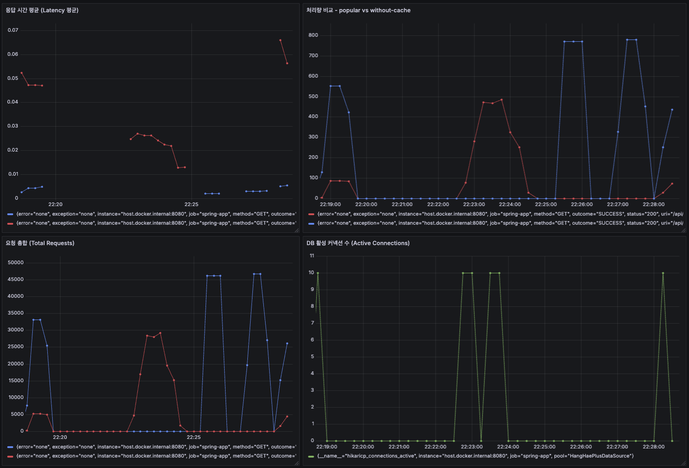

### **`STEP12 - Cache 보고서`**

### 🧩 문제 인식

인기 상품 조회 API(`/api/v1/products/popular`)는 트래픽이 집중되거나 대량 요청이 동시에 들어오는 경우 DB 조회 부하가 급증할 수 있다.

특히 인기 상품은 자주 바뀌지 않음에도, 동일한 쿼리가 반복되어 호출되어 캐시가 없을 경우 성능 저하로 이어진다.

---

### 🧠 설계 및 캐싱 전략 적용

- **적용 대상**: `getPopularProducts(criteria)`
- **패턴**: Cache-Aside Pattern + `@Cacheable(sync = true)`
- **캐시 키**: `"popular:{days}:{limit}"`
- **스토리지**: Redis

```java
@Cacheable(
    value = "popularProducts",
    key = "'popular:' + #criteria.days() + ':' + #criteria.limit()",
    sync = true
)
public List<PopularProductResult> getPopularProducts(PopularProductCriteria criteria)
```

- `sync = true`: 최초 요청 하나만 DB를 조회하고, 나머지는 블로킹 → **Cache Stampede 방지**
- `@Transactional(readOnly = true)`로 불필요한 쓰기 지연 제거

---

### 🔥 성능 측정 결과 (k6)

| 구분 | 처리량(RPS) | 평균 응답시간 | 요청 수 |
| --- | --- | --- | --- |
| **캐시 미적용** | 442 req/s | **44.97ms** | 4,433회 |
| **캐시 적용** | **2,734 req/s** | 7.17ms | 27,369회 |
- **캐시 적용 시 처리량 약 6.1배 증가**
- **응답 시간 약 83% 감소**
- 부하 대응 및 확장성 측면에서 확연한 개선

📂 [사용한 k6 스크립트 경로](../../monitoring/k6/scripts)

📂 [k6 스크립트 실행결과](../../monitoring/k6/result)

---

### 🧷 스탬피드 방지 전략

`@Cacheable(sync = true)` 외에도 **주기적인 캐시 프리로딩(Pre-warming)** 작업을 도입:

```java
@Scheduled(cron = "0 0 3 * * *")
public void warmUpPopularProducts() {
    List.of(new PopularProductCriteria(3, 5))
        .forEach(productFacade::getPopularProducts);
}
```

- 새벽 3시, 비교적 사용자 요청이 적은 시간대에 **주요 캐시 키를 미리 로딩**
- 실 사용 시점에는 **이미 캐시가 준비된 상태** → 빠른 응답 보장

### 📊 Grafana 모니터링 지표 구성

| 지표 | 설명 |
| --- | --- |
| 응답 시간 평균 | 캐시 유무에 따른 Latency 비교 |
| 처리량(RPS) | 인기 상품 API의 처리량 비교 |
| 요청 총합 | API 호출 횟수 시각화 |
| DB 커넥션 수 | 캐시 미적용 시 커넥션 소모 증가 확인 |




### 🧭 결론

- 캐시 도입만으로 응답시간을 **~83% 단축**하고, **DB 커넥션 부하를 현격히 줄임**
- `@Cacheable(sync = true)`와 **웜업 스케줄링 조합으로 스탬피드 및 초기 캐시 부재 이슈 방지**